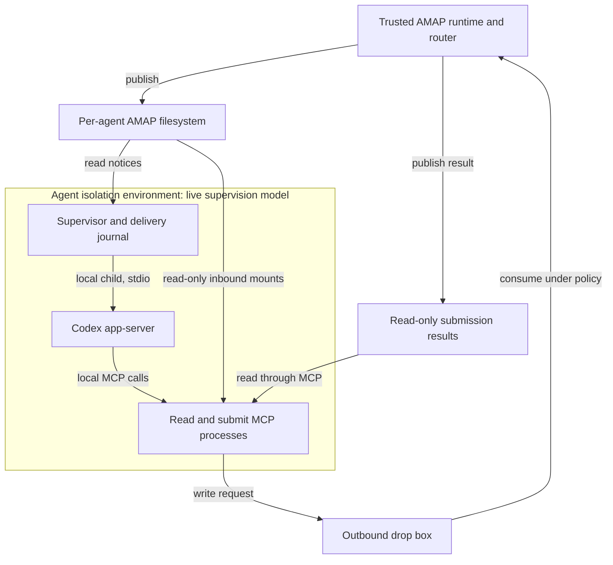

# AMAP Codex Connector Implementation Design

Status: v0.1 reference implementation; in-environment pilot demonstrated

Repository: `proofpoint/amap-connector-codex`

Compatibility evidence: `compatibility/README.md`

## 1. Decision and delivery target

Build a local Codex connector that preserves the existing AMAP arrangement: a trusted runtime/router publishes into per-agent filesystem namespaces, an isolated agent reads locally mounted inbound data, and outbound requests pass through a filesystem drop box to the runtime for policy enforcement and sending.

Use a small supervisor to launch and drive one dedicated `codex app-server` over stdio. Where it runs is a deployment choice (§1.1, §1.2). Reuse the Claude connector's local MCP read and submit servers. Replace its Claude-specific Unix-domain-socket delivery code with a Codex app-server adapter. The supervisor, rather than the model, watches for inbound notices and starts work.

Longer term, add a network facade over the same filesystem contract. Its MCP tools and MCP Events will support remote agents such as Work Cloud and dots. Preserve a small separation between notice handling and delivery transport now; do not implement the remote service in v0.1.

### 1.1 In-environment supervision

The supervisor can run **inside the agent's isolation environment**, started by that environment's process supervision, and launch `codex app-server` as a direct local child through the default launcher. Codex then uses the environment's own `~/.codex`. No root execution, host service, host-side journal or credential copy is involved, and the isolation system needs no new interface.

The trade is accepted on the spec's own trust model. The supervisor's journal and claims are reachable by the agent it serves, so a compromised agent can disrupt delivery to itself. It can already ignore, misreport or forge outcomes about its own work (AMAP §13.15), and the Runtime's own record and its submit-time authorization are what the fleet relies on. The Claude connector's delivery daemon can run with the same posture.

### 1.2 Deferred: host-side supervision

Running the supervisor (for Codex, and for Claude) on the host instead, outside the agent's reach, remains a possible future deployment. The connector keeps the launcher-control contract (`docs/contracts/LAUNCHER-CONTROL.md`) so that move is a new deployment adapter, not a connector rewrite. It is deferred because what it protects, the agent-side delivery journal, is not evidence under the spec, while its cost is a host-to-session execution interface the isolation system must provide (exact container binding, inspect/stop with proof that every descendant has stopped, survival of attach-client death), per-OS host services, and for Claude a delivery path into a socket inside the container.

Revisit it when any of these holds:

1. The isolation system ships such an execution interface as a maintained, consumer-neutral contract.
2. A requirement appears that an agent must not be able to tamper with its own delivery state, such as an audit or compliance need.
3. Agents are to be started on demand for incoming work, rather than delivered to only while an operator-launched session runs.

**Status:** the required app-server behavior is measured on the reviewed builds (`compatibility/README.md`), and a live deployment has carried delegations in both directions with the reference router (`compatibility/README.md`). Official documentation labels app-server experimental, so this is a reference release rather than a production support commitment; any build runs, and delivery relies on the live checks. [S4]

## 2. Scope

| Include in v0.1 | Defer |
| --- | --- |
| One configured AMAP namespace per supervisor | Multi-tenant service and dynamic agent provisioning |
| One supervisor-owned Codex thread | Attaching to arbitrary pre-existing CLI or desktop sessions |
| Local read-only mail and peer mounts | Work Cloud, dots, remote MCP hosting, and MCP Events |
| Existing local MCP readers and gated submit tools | Changing AMAP schemas or implementing mail transport |
| Mail notification and peer delegation | Concurrent turns, mid-turn injection, and priority preemption |
| Durable delivery journal and conservative restart recovery | Exactly-once execution or automatic replay of uncertain work |
| Headless operation with status/log output | Full terminal UI, approval UI, and desktop integration |
| Existing attachment behavior and peer lookup | Remote file upload/download API and new directory semantics |
| One Linux deployment using the existing sandbox approach | Cross-platform launchers and a reusable isolation framework |

Native MCP Events are not a dependency for this local implementation. Local MCP remains the tool interface. App-server is the separate session-control interface. A connector-internal event record must not be advertised as an MCP Events implementation.

## 3. Baseline and source ownership

Pin the initial import to these reviewed source revisions:

| Source | Revision | Use |
| --- | --- | --- |
| `proofpoint/amap-connector-claude` | `ca9b40647c5c002e6e6fe30b4fea54e64a76af57` | MCP tools, consumer claims, admission behavior, tests |
| `proofpoint/amap-spec` | `2ffdfeb06631329fad3678788d03e854c92ba98b` | Filesystem contract, schemas, peer profile, fixtures |
| Codex | Reviewed builds in `REVIEWED_CODEX_VERSIONS` | Generated protocol schema and live compatibility evidence |

The AMAP specification release label and the `contract_version` inside artifacts are different version axes. The pinned artifacts use wire major `"2"`; do not replace that value with `"3.1.0"`. Follow each artifact's version and extension rules. Runtime-authored extensible documents must tolerate unknown members where the contract requires it; closed submit schemas must remain closed. [S2, S3]

Vendor the small generic Python executables and their relevant tests into the new repository, preserving the upstream license and attribution. Add `UPSTREAM.md` with source URL, commit, imported files, and local differences. Avoid introducing a shared package or modifying the Claude repository in this sprint. The current README anticipates future common-code factoring, but extraction across repositories should follow a working second implementation. [S1]

Review inherited comments against executable behavior. For example, the submit script has older prose suggesting every attachment requires human approval, while its current tool guidance correctly leaves that decision to the relay. Correct misleading copied documentation without changing policy or claiming content scanning exists.

Three small compatibility patches belong in the initial port. Replace Claude-specific cross-session/SendMessage instructions in tool metadata with the Codex workflow. Carry validated peer correlation metadata in the delivery event because the current reader does not display the peer message ID. Align inbound version checks with the pinned contract: the current reader tolerates legacy missing versions, while the current contract requires a version check before schema validation and refusal of missing, lower, or higher majors. Add focused tests and record these intentional differences in `UPSTREAM.md`; preserve the tool call signatures and filesystem format.

## 4. Process and filesystem architecture



The live model places the supervisor inside the isolation environment (§1.1).
It owns the app-server pipes, delivery state, locks and target thread binding,
and reuses the environment's Codex authentication. The agent can reach its own
delivery journal and claims. Neither the supervisor nor the model has mail
credentials or sending authority; the router retains those capabilities.

The default launcher runs app-server as a direct local child. The deferred
host-side model (§1.2) supplies a deployment-owned launcher and, for remote
execution, the optional generic inspect/stop contract. The supervisor receives
an explicit argument vector and never builds a shell command from message
content. Use pipes, not a PTY. Diagnostics go to stderr; stdout contains only
app-server protocol frames. Remote adapters must prove cleanup of the exact
execution and all descendants after launcher death.

Isolation lifecycle is a deployment concern. The Compose example is optional
and has not been demonstrated live. The agent must not receive a host control
socket or container engine. Agent-inaccessible supervisor state is a property
of the optional host-side model, not of the demonstrated in-environment model.

### Mount and permission contract

Paths must be explicit in deployment configuration and visible where their
consumer runs. Host-side supervision can use different host and sandbox paths;
never derive a privileged host path from agent-provided data.

| Resource | Router | Supervisor | Isolated agent and MCP tools |
| --- | --- | --- | --- |
| `inbound/notices` and `inbound/messages` | Publish and retain | Read | Read-only |
| `peer/notices` and `peer/messages` | Publish and retain | Read | Read-only |
| Attachment sidecars in each lane's `notices` tree | Publish and retain | Read only if needed for validation | Read-only |
| Outbound request drop box | Read/process | No write needed for delivery | Write requests and attachment sidecars |
| Submission `results` and `processed` views | Write | No write | Read-only; include the paths the imported tool uses |
| Runtime roster | Write | No write | Read-only |
| Connector binaries and operator workflow configuration | Deployment writes | Read | Read-only |
| Supervisor journal, consumer claims, target binding | No write except agreed claim ownership mechanics | Read/write | Reachable in-environment; outside agent mounts for host-side supervision |
| Connector outcome extension | Read/consume by agreement | Write | Agent-reachable in-environment; claims only, never runtime authority |
| Agent working directory | No access required | No access required | Read/write |
| Codex runtime state and authentication | Provisioned separately | Accessible through the selected launch/session mechanism | Per existing Codex deployment requirements |

Use read-only bind mounts or equivalent OS-enforced boundaries. Permission bits on files owned by the same uid as the agent do not establish immutable input. Mount only this agent's namespace. Keep privileged configuration outside the writable work directory. The Codex sandbox policy is an additional restriction; it does not replace the mount boundary.

The inherited submit implementation reads pending, processed, and result names when allocating request IDs. Its configured `OUTBOX_DIR` must present that expected layout. Verify nested read-only result/processed mounts and atomic attachment staging in the actual sandbox. Do not assume a generic `/outbound` mount is sufficient.

Codex authentication is required for the agent; mailbox/provider credentials are prohibited in its environment. Reuse the deployment's Codex authentication provisioning and model egress policy. This sprint does not introduce a new credential broker.

## 5. Minimal repository structure

Use Python 3.11 or later for new supervisor code, with `asyncio`, `sqlite3`, and standard-library process/file primitives. Reuse the stdlib-only MCP executables. Development dependencies may include `pytest` and `jsonschema`. A Python app-server client is sufficient because the control transport is line-oriented JSON; do not add a second language solely for an SDK wrapper.

| Path | Responsibility |
| --- | --- |
| `README.md` | Installation, supported Codex version, pilot quickstart, limitations |
| `docs/DESIGN.md` | This design |
| `docs/OPERATIONS.md` | Status, recovery, approvals, retention, troubleshooting |
| `UPSTREAM.md`, `LICENSE` | Provenance and license preservation |
| `bin/inbox-mcp-vol`, `bin/inbox-submit` | Vendored read and submit tools |
| `src/amap_codex/claims.py` | Adapted upstream claim helper with provenance |
| `src/amap_codex/spool.py` | Read notices and validate lane-specific admission |
| `src/amap_codex/journal.py` | Durable events, attempts, target binding, outcome transitions |
| `src/amap_codex/app_server.py` | Framing, handshake, RPC correlation, lifecycle and failure handling |
| `src/amap_codex/supervisor.py` | Scan, queue, dispatch, and restart orchestration |
| `src/amap_codex/outcomes.py` | Optional configured router outcome side channel |
| `src/amap_codex/cli.py` | `run`, `doctor`, `status`, and explicit recovery commands |
| `config/connector.example.toml` | Supervisor configuration for the selected execution environment |
| `config/codex.example.toml` | Sandbox-local MCP registration and selected permissions |
| `config/operator-instructions.md` | Trusted mailbox workflow, deployed read-only |
| `deploy/` | One pilot launcher and mount example |
| `tests/fixtures/`, `tests/fake_app_server.py` | Deterministic protocol and filesystem tests |
| `tests/integration/` | Opt-in live Codex and real-router tests |
| `compatibility/` | Codex version, schema subset, and smoke-test findings |

Use one concrete `AppServerDelivery` adapter behind a narrow Python interface. Avoid a plugin registry or general event bus. Suggested operations are `start_or_resume`, `deliver`, `observe`, and `stop`. `deliver` returns accepted, definitely-not-submitted, or uncertain; it must never collapse the last two states into a generic retryable error.

## 6. Reused tools and configuration

Register three local MCP server instances inside the sandbox:

| Server | Tools | Filesystem view |
| --- | --- | --- |
| `inbox` | `list_messages`, `read_message`, `read_attachment` | Mail lane |
| `delegation` | Same reader executable and tools | Peer lane with `INBOX_LANE=peer` |
| `inbox_submit` | `submit`, `submit_result`, `peers` | Outbound drop box and roster |

Keep the reader's lane-specific instructions and content framing. `submit` creates an inert request; its queued response is not evidence of a sent message. `submit_result` supplies the runtime's outcome. Roster membership is discovery information, not sending authorization. `identity.json` is informational and optional; it is not the supervisor's authority for identity. [S1–S3]

Illustrative sandbox configuration using the documented Codex MCP registration shape [S5]:

```toml
[mcp_servers.inbox]
command = "/opt/amap-connector-codex/bin/inbox-mcp-vol"
required = true
[mcp_servers.inbox.env]
INBOX_MESSAGE_DIR = "/amap/inbound/messages"
INBOX_LANE = "mail"

[mcp_servers.delegation]
command = "/opt/amap-connector-codex/bin/inbox-mcp-vol"
required = true
[mcp_servers.delegation.env]
INBOX_MESSAGE_DIR = "/amap/peer/messages"
INBOX_LANE = "peer"

[mcp_servers.inbox_submit]
command = "/opt/amap-connector-codex/bin/inbox-submit"
args = ["mcp"]
required = true
[mcp_servers.inbox_submit.env]
OUTBOX_DIR = "/amap/outbound/dropbox"
AMAP_ROSTER_DIR = "/amap/roster"
AMAP_SELF = "analyst@fleet.example"
```

These are example deployment paths, not new AMAP defaults. Omit the peer server for a mail-only deployment and omit submission for a read-only deployment. Do not make a missing optional lane silently change a peer-enabled deployment into mail-only mode.

Define the following supervisor configuration independently of Codex's TOML:

| Setting | Requirement |
| --- | --- |
| `instance_id` | Stable deployment identity; part of event keys |
| `self_address` | Operator-supplied bare addr-spec; required with peer lane |
| `launch_argv` | Explicit trusted launcher argument vector |
| `mail_notice_dir`, `mail_message_dir` | Explicit supervisor-visible paths for enabled mail lane |
| `peer_notice_dir`, `peer_message_dir` | Explicit supervisor-visible paths for enabled peer lane |
| `mail_claim_path`, `peer_claim_path` | Existing canonical claim locations for those spools |
| `state_dir` | Mode `0700` supervisor state retained across restarts; accessibility follows §1.1 or §1.2 |
| `outcome_dir` | Explicit optional extension path understood by the router |
| `codex_model`, sandbox working directory, permission profile | Explicit deployment choices; validate against installed build |
| `poll_interval_ms` | Initial default 1,000; use polling to avoid watcher dependencies |
| `max_pending_events` | Initial default 1,000; pause scanning and report backlog when reached |
| `rpc_timeout_seconds` | Initial default 30; timeout after dispatch is uncertain |
| `turn_watchdog_seconds` | Initial default 900; surface blocked/long-running work, never replay it automatically |

All path errors fail at startup. Persist a fingerprint of instance identity,
roots and trusted configuration; use explicit `migrate` for a reviewed
configuration change while retaining the journal. Do not reset delivery state
to bypass uncertainty, reuse a journal for another mailbox or silently replace
its thread. Build/model changes are audited separately (§11).

## 7. Session lifecycle and first integration gate

Use the installed binary's generated JSON schema to validate the implementation. The documented interfaces include stdio JSONL, initialization, thread start/resume/read, turn start, and a standalone `toolOutput` form of turn start. The latter retains input as tool output and requires an empty `input` array. [S4]

Before implementing the full watcher:

1. Record `codex --version` and generate the app-server JSON schema.
2. Launch app-server through the actual sandbox launcher and complete initialization.
3. Start one persistent thread with the selected model and operator workflow; store its ID before accepting notices.
4. Confirm all required MCP tools initialize and can read a synthetic spool.
5. Deliver a synthetic event using standalone tool output and observe a completed turn.
6. Restart and resume the same thread; verify persisted input can be inspected.
7. Exercise an approval request, a user-input request, and subprocess death.

Wait for the initialization response before proceeding. Correlate each response by request ID. Read stdout continuously, including server-initiated requests; never block the protocol reader while awaiting an individual response. Send logs to stderr. Enforce bounded frame sizes that accommodate the imported attachment tool's output; measure that bound with a maximum supported attachment rather than selecting an arbitrary tiny limit.

For v0.1, dispatch only while the bound thread is idle. Queue new notices while it is active. Do not implement mid-turn steering even if the pinned build supports it. One active event at a time makes failures attributable and avoids having several delegations share an indistinguishable execution outcome.

The supervisor owns the thread for its lifetime. It does not discover a target by enumerating whichever sessions happen to exist. On restart, use the persisted thread ID; an inaccessible thread blocks delivery and requires explicit recovery.

### Input representation

Use standalone tool output for connector event data as verified by the compatibility probes. The fixed source name belongs to the connector, not to a sender. The following illustrates the adapter envelope; the exact request shape must match the pinned schema:

```json
{
  "id": 41,
  "method": "turn/start",
  "params": {
    "threadId": "configured-thread-id",
    "input": [],
    "toolOutput": {
      "name": "amap_notice",
      "namespace": "amap_connector",
      "output": "{\"event_id\":\"stable-event-id\",\"lane\":\"peer\",\"notice_id\":\"runtime-notice-id\"}"
    }
  }
}
```

This is app-server tool-output delivery, not an MCP notification. The minimal example shows the lookup pointer. For a peer event, also include validated `peer_from` and `peer_message_id` from the notice, plus `in_reply_to`, `references`, and `task_id` when present and valid. These fields retain their distinct AMAP meanings. Do not include subject, preview, or body. Fetch peer request bodies through `delegation.read_message` so inherited framing remains in one place. Runtime-asserted peer identity comes from the admitted notice metadata; a display header in the body must not override it.

If the selected build lacks usable standalone tool output, the bounded fallback is an operator-authored, content-free wake-up template containing only validated lane/notice identifiers and the same validated peer correlation metadata. The model fetches all sender text through the read tools. Prove and document the fallback on day one; do not inject a raw email or peer body as a user/developer instruction. If neither approach works reliably, stop the implementation spike and report the compatibility blocker.

Deploy the operator workflow through the pinned build's supported instruction mechanism, read-only and outside agent-writable configuration. Do not invent an app-server instruction field. During the spike, demonstrate that the workflow is present on both initial start and resume.

## 8. Notice admission and agent behavior

### Mail lane

Scan the runtime-owned mail notice tree without modifying it. Check the wire version before schema validation, accepting only supported major `"2"`; classify other versions or absence as a distinct version refusal. Validate shape, safe identifier, filename binding, and the mail lane's `kind == deliver` requirement. Apply the corresponding version gate when reading published bodies. The event contains no subject, preview, sender text, or body. The agent retrieves the message through the mail reader. Mail is from a peer on both sides of the operator's mutual allowlist, and its requests are meant to be acted on within the agent's existing authority (the operator instructions are the fleet's inbox policy); what it quotes, forwards or attaches remains untrusted data.

Deliver one notice at a time initially; do not add batching/coalescing until the basic path is measured. Include the notice ID to avoid repeated full-inbox scans. A duplicate filesystem scan must not start another turn for an already accepted event.

### Peer lane

Port the current connector's admission checks before dispatch:

- Obtain origin class from the configured `peer` tree, never from a claimed sender field in mail.
- Check supported version, filename/notice ID binding, `kind == peer`, and valid sender address.
- Check the recipient against operator-configured `self_address` using the published **body document's `to` field**. The current notice does not carry that binding.
- Refuse router-origin task attempts according to the existing connector convention.
- Require a readable published body with expected fields. Do not fall back to a mail provider or another tree.

Use the runtime's authenticated peer identity. A delegation is the operator's grant: its requests are meant to be acted on, within the receiving agent's existing authority, and a reply to the sender needs no permission. Where the router's guarantee does not reach (credentials, network outside the message path, irreversible or off-host changes) the agent does not act and tells the sender it needs the operator. Quoted/forwarded text and attachments remain untrusted. No AV, DLP, or prompt-injection scanning is added by this connector.

Handle a malformed artifact as a recorded refusal/error for that notice, with an operator-visible reason; continue scanning other notices. Distinguish transient incomplete publication from permanently invalid data using the runtime's actual publish-order guarantee established in the pilot. Do not permanently refuse a body merely because the router has not finished publishing it; use a bounded grace/retry state if publication is not atomic across notice and body.

### Reply correlation

Keep the receiver's `notice_id` and the sender's `message.id` distinct. Use `notice_id` to locate local spool content and deduplicate delivery. Set the MCP `submit.in_reply_to` argument to the event's `peer_message_id`; the imported tool maps that argument to `draft.reply_to_message_id` in the request JSON. Set the reply recipient to validated `peer_from`. Confirm the mapping with a fixture where notice ID and message ID differ. Preserve any existing `task_id` obligations; matching a task ID grants no authority by itself. [S3]

The peer profile uses the same lane for requests and replies. Retain a notice's `in_reply_to` metadata so the standing workflow can recognize a work result. Consume a result into the ongoing task; do not automatically send an acknowledgment to every result. Add a round-trip test that settles without an endless reply/acknowledgment loop. Subsequent peer work requires an actual workflow reason.

The trusted workflow tells the agent to reply through `inbox_submit.submit`, then check `submit_result`. A Codex final response is a local execution transcript and must never be automatically converted into an outbound message. A queued submission, a completed turn, and a delivered reply are separate facts.

### Attachments

Reuse descriptor handling, explicit byte access, content-reference binding, containment checks, and hash verification. Mount each lane's notice-side attachment directories along with its message directory. Outbound attachment paths refer to files inside the isolated agent; sidecars must commit before the request JSON. Preserve inherited size/count limits. A remote agent will need a different attachment transport later.

## 9. Durable state and delivery semantics

Use SQLite in the supervisor's state directory, with transactions and an
appropriate durable synchronous setting. State accessibility follows the
selected supervision model (§1.1, §1.2). Keep event state independent from files
consumed or deleted by the router.

Suggested tables:

| Table | Key information |
| --- | --- |
| `instance` | Instance ID, configuration fingerprint, bound thread ID, tested Codex version |
| `events` | Unique `(instance_id, tree, notice_id)`, stable event ID, observed artifact hash, state, timestamps |
| `attempts` | Event ID, attempt number, RPC ID, dispatch time, accepted turn ID, error classification |
| `outcome_transitions` | Event ID, transition, detail, publication state |

Use a stable hash of instance ID, tree, and notice ID for the event ID. Keep `mail` and `peer` in all keys. If the same key later appears with changed artifact contents, surface a publication/integrity conflict instead of treating it as new work. Record only metadata and hashes by default, not message bodies.

Suggested event states:

| State | Meaning and next action |
| --- | --- |
| `pending` | Admitted and persisted; eligible when the thread is idle |
| `dispatching` | Attempt committed before writing the request; possible delivery window begins |
| `accepted` | Correlated app-server acceptance observed and persisted; never automatically redeliver |
| `finished` | Associated turn reached a terminal status; store completed/failed/interrupted separately |
| `refused` | Deterministic admission failure; operator action required to revisit |
| `uncertain` | Request may have crossed the boundary but acceptance is not known; block automatic replay |

Keep blocked approvals and operational errors as attempt/thread status rather than interpreting them as proof of non-delivery. An accepted turn can later be blocked or fail.

### Dispatch transaction

1. Persist an admitted event with a unique key.
2. When idle, commit `dispatching` and the attempt/RPC ID before writing to stdin.
3. On an unambiguous correlated success, persist the returned turn association and `accepted` state.
4. On a proven pre-send failure, restore eligibility with bounded backoff.
5. On partial writes, timeout, disconnect, process death, or ambiguous error, persist `uncertain`.
6. On terminal turn notification, persist the execution result. Do not replay a failed accepted turn automatically.

A JSON-RPC error is safely retryable only when the tested method/error contract establishes that no work was accepted. Generic server errors are not proof. Local queueing is bounded; leave excess notices in the source spool and report backlog rather than dropping them.

### Restart recovery

Acquire exclusive ownership before launching or resuming. Reconcile any `dispatching` or `uncertain` attempt with persisted thread history, looking for the exact connector event ID in its original input/tool-output item. A matching item is evidence of acceptance for deduplication, not proof of completed work or an authoritative AMAP delivery attestation.

If history is incomplete, unavailable, or lacks enough information to settle the attempt, leave it uncertain and pause dispatch for that instance. Absence from a partial history is not evidence that delivery failed. Provide explicit operator actions to mark an event handled or retain it on hold, with an audit note. A retry is permitted only after positive evidence establishes that the prior attempt caused no action; an operator's willingness to risk duplication is not evidence. Do not silently create another thread to escape the uncertainty.

### Guarantees

The peer profile requires that the connector not cause a message to be acted on more than once. Serial ownership, recorded acceptance, and refusal to replay uncertain work enforce that requirement conservatively, at the cost of operator recovery and potentially unfinished work. [S3] The connector prevents ordinary duplicate delivery from repeat scans and restarts after recorded acceptance. It does **not** guarantee exactly-once model execution or exactly-once outbound side effects. The inherited submit tool allocates requests but does not supply semantic idempotency for repeated model calls. A fresh request with identical content may be a second send. Do not claim stronger guarantees without a separate submit/runtime idempotency design.

## 10. Consumer ownership and router outcomes

Reuse the canonical spool claim locations and compatible upstream claim semantics. A Codex-specific lock at a different path would allow Claude and Codex to consume the same spool simultaneously. All consumers of a spool must contend on the same claim.

In the direct-launch model, consumers of a spool must share the PID/liveness
domain used by the claim helper. Container claims are not host PID claims.
Host-side remote adapters use the explicit owner/execution binding contract;
`/proc` alone cannot establish remote liveness. Acquire all enabled lane claims
before accepting work and release partial acquisitions on startup failure.
Never automatically reclaim an ambiguous live owner.

The upstream delivery outcome vocabulary is a connector/deployment convention, not a normative AMAP peer artifact. `outbound/ext/<name>` is an opaque extension path that a router may consume by agreement. [S1–S3]

Propose `outbound/ext/codex/outcomes` for this connector. Verify that the target router can be configured for it. A router hardcoded to the Claude path needs a small deployment or adapter change; do not promise zero router changes until that is checked. Never reuse the name `claude-code` for Codex output.

| Proposed peer outcome | Evidence |
| --- | --- |
| `delivered` | App-server accepted the event into the bound thread; detail explicitly says acceptance, not execution completion |
| `refused` | Admission validation rejected the notice |
| `inject_failed` | Proven failure before acceptance; may retry |
| `held` | Not yet accepted and waiting for operator resolution or an uncertain delivery window; detail distinguishes cause |

Do not fabricate `denied` from an unrelated shell approval refusal or map every turn failure to non-delivery. Once delivered is recorded, subsequent task failures stay in execution diagnostics or an explicit peer response. Mail notifications do not need peer delivery outcomes.

Retain the upstream outcome file shape where the router expects it: `outcome`, `ts`, `tree`, `notice_id`, and bounded `detail`. The router may remove outcome files after reading them. Keep transition history in SQLite and publish atomically. Confirm repeated publication is safe with the actual router; outcome recovery must not use absence of a file as proof that a transition was never consumed.

Outcome files are connector claims rather than proof or new authorization,
including when the agent can reach them in the in-environment model. The AMAP
runtime remains the security authority.

## 11. Approvals and operational behavior

The supervisor must respond to or explicitly resolve server-initiated requests. A write-only app-server client can stall indefinitely on approvals or user questions. Pin and test the relevant response schemas. [S4]

For the headless pilot, provision an explicit narrow permission profile covering required workspace operations and MCP tools. When additional approval is requested, decline/cancel using the pinned protocol, record the blocked operation, and surface it in status. For a request requiring user input, use the supported cancellation path or interrupt the turn. Do not invent answers or auto-approve to keep the daemon running. An operator can revise policy or handle the task through an explicit recovery workflow.

Status must include instance identity, bound thread, enabled lanes, claim state, current turn, pending count, oldest pending age, uncertain count, last successful acceptance, and last operational error. Log stable event/notice IDs and state transitions; exclude message bodies, attachment bytes, and credentials by default.

Clean startup reconciliation clears a resolved operational diagnostic and
retains its previous value in the audit. Unresolved history, operator work,
client errors or outcome publication keep their diagnostic; clearing an error
does not alter delivery or publication state.

Developer instructions stay fixed at thread start on the reviewed builds.
Changing them requires explicit migration to a new thread on the kept journal,
with no in-flight/uncertain work. Build and model changes are audited while
preserving the existing delivery state and thread.

On graceful shutdown, stop admitting new dispatches, allow a bounded period for the active turn, then interrupt/stop through the verified lifecycle. Persist final known state, reap the launched process, and release claims. If acceptance remains unresolved, leave the event uncertain. On startup, detect orphaned sandbox processes before starting a second controller.

Retention belongs to the runtime. A queued notice whose published body is removed cannot be reconstructed by this connector; record it as unavailable and surface it. Set the pilot retention window longer than expected backlog and outage duration. Do not delete terminal journal records while retained notices could be rediscovered.

## 12. Validation and acceptance criteria

Run deterministic tests on every change and live tests only where they exercise real integration. Capture the Codex version and deployment fingerprint with live results. Use synthetic mail and explicitly configured test peers.

| Test | Required result |
| --- | --- |
| Imported reader and submit regression suite | Existing signatures and attachment constraints preserved; intentional metadata/version changes have targeted expectations |
| Read-only input mounts | Agent can read; attempted writes, renames, chmod-based mutation, and symlink substitution cannot alter runtime input |
| Namespace isolation | Agent cannot read another mailbox, router credentials or container control endpoint; host-side supervision additionally protects its journal, while §1.1 permits access to the agent's own delivery state |
| Wire compatibility | Imported fixture/version rules pass, including tolerated unknown runtime members |
| Peer admission | Wrong recipient, wrong tree/kind, malformed sender, and router-origin task attempts refused |
| Distinct correlation IDs | Local read uses notice ID; reply correlates using the required peer message ID |
| Peer result handling | Correlated result is consumed without an automatic reply loop |
| Idle notification | Synthetic mail wakes a turn and is fetched through the mail reader |
| Peer round trip | Runtime-admitted request is fetched, acted on, and explicitly replied to through gated submit |
| Busy thread | New notices wait; no concurrent dispatch or lost work |
| Repeated scan and restart | Recorded accepted events do not produce another delivery |
| Crash before, during, and after dispatch | Proven unsent work retries; ambiguous work becomes uncertain; accepted work is not replayed |
| Approval and user-input requests | Headless operation fails visibly without hanging or broadening permissions |
| Claim contention | Claude-compatible consumer and second Codex supervisor cannot claim the same enabled spool |
| Router outcome integration | Router reads configured Codex extension and distinguishes acceptance from business result |
| Attachments | Valid bytes resolve; traversal, cross-lane references, withheld bytes, and hash mismatch fail appropriately |
| Submission result | Queued/held/rejected outcomes are not reported as sent |
| Burst and retention | Bounded queue preserves pending work; missing retained content produces an explicit diagnostic |
| Signal/process cleanup | Supervisor stop reaps app-server and releases ownership without orphan execution |

The release demonstration is a real-router peer round trip inside the actual sandbox, followed by a supervisor restart, duplicate scan, and a deliberately interrupted dispatch. A fake app-server proves controller logic; it does not satisfy the live compatibility gate.

## 13. Future network facade

The AMAP filesystem remains on operator-controlled infrastructure. A future authenticated MCP service reads that filesystem and writes gated requests locally; remote agents receive tool results. A notice worker delivers MCP Events to the hosted agent. Work Cloud and dots do not mount or synchronize the AMAP directories.

OpenAI's current MCP Events integration documents Work Cloud/dots, webhook subscriptions, callback verification, and signed delivery, with MCP 2.0 protocol version `2026-07-28`. Webhook acknowledgment establishes receipt, not completed execution. Revalidate those requirements when beginning that phase. [S6]

Preserve only these extension points now:

1. The notice reader produces a validated event independent of Codex framing.
2. A delivery adapter maps that event to session acceptance evidence.
3. Read/submit operations remain separate from delivery control.
4. Journal keys and execution status do not assume a particular network transport.

Later work will add authenticated principal-to-namespace binding, remote tool transport, subscription persistence, signed webhook delivery/retry, callback validation, attachment transfer, and remote execution acknowledgment semantics. The current stdio tool servers cannot become MCP 2.0 merely by changing a protocol version string. Implement and test the required protocol surface.

Do not carry local path arguments into the remote API: outbound attachments will require upload handles or a scoped byte-transfer mechanism. Revisit idempotent submission before enabling retry-heavy remote workflows. Do not share a single consumed-event flag across independent subscribers; separate source event identity from per-subscription delivery state and define whether multiple subscribers may act on a mailbox.

The local pilot can therefore ship without a web server, OAuth implementation, subscription database, or cloud dependency. Its AMAP operations and delivery boundary become the foundation of the later facade.

## Sources

- **S1 — Claude connector baseline:** [README and implementation](https://github.com/proofpoint/amap-connector-claude/tree/ca9b40647c5c002e6e6fe30b4fea54e64a76af57). Relevant files: `bin/inbox-mcp-vol`, `bin/inbox-submit`, `bin/inbox-delivery`, `bin/_inboxlib.py`, and the tests.
- **S2 — AMAP filesystem contract:** [Pinned contract](https://github.com/proofpoint/amap-spec/blob/2ffdfeb06631329fad3678788d03e854c92ba98b/spec/contract.md), especially namespace ownership, attachment paths, submission, results, identity, and extension rules.
- **S3 — AMAP peer profile:** [Pinned peer-origin profile](https://github.com/proofpoint/amap-spec/blob/2ffdfeb06631329fad3678788d03e854c92ba98b/spec/peer-origin.md), with pinned schemas and fixtures in the same repository.
- **S4 — Codex app-server:** [Official interface documentation](https://learn.chatgpt.com/docs/app-server). Consult the installed build's generated schema for exact requests and responses. Retrieved October 6, 2026.
- **S5 — Codex MCP configuration:** [Official MCP documentation](https://learn.chatgpt.com/docs/extend/mcp). Retrieved October 6, 2026.
- **S6 — Hosted MCP Events:** [Official MCP Events documentation](https://developers.openai.com/plugins/build/mcp-events). Future-phase reference, retrieved October 6, 2026.

The architecture, state machine, defaults, repository layout, and schedule above are proposed implementation decisions. They are not claims that an existing Codex connector already implements these behaviors.
