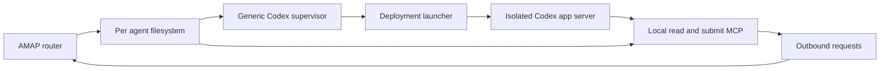

# Dedicated Codex sandbox rollout

Rollout is blocked pending the review follow-up on [Sandy #444](https://github.com/rappdw/sandy/pull/444)
and the lifecycle design in [Sandy #446](https://github.com/rappdw/sandy/issues/446).
#444 now covers protected submounts only. Protected sources must be outside
**every** writable mount source, including their parent, and destinations must
already exist. The deployment draft must revise its current result/processed
source layout and replace its dependency on Sandy's removed `managed_exec.py`.
That helper cannot write under `/run` in Sandy's read-only container root;
only `/tmp` and `/home/sandy` are tmpfs. The operator apply/provision/service and
round-trip commands below are a draft, not authorization or readiness to run them.
No fleet changes have been applied.

Add one dedicated Codex sandbox to the existing AMAP fleet, then demonstrate
Codex to Claude to Codex and Claude to Codex to Claude round trips through the
real router. Keep the connector portable by putting isolation details in a
deployment adapter. Preserve the existing fleet's identities, spools, router
state and policy edges throughout the pilot.

Engineering changes are prepared in this workspace and separate
integration branches. See [implementation evidence](ENGINEERING-VERIFICATION.md)
and the [operator runbook](OPERATOR-RUNBOOK.md). Integration changes are delivered
through PRs with manual review and merge; no automatic merging or fleet changes.
Live host isolation, router and round-trip gates remain pending. The host protocol
probe in [compatibility](../compatibility/README.md) does not satisfy those gates.

## Architecture and repository ownership

The host supervisor reads validated AMAP notice pointers, owns the journal and
controls one app-server thread. A deployment launcher runs app-server inside
the selected isolation environment. The agent uses local MCP tools to read
messages and write inert submissions; the router authorizes and transports
them. The launcher may use Sandy, a direct container, a VM or another local
isolation system without changing notice admission or delivery semantics.

| Repository | Responsibility | Handoff |
| --- | --- | --- |
| amap-connector-codex | Generic execution lifecycle, conservative ownership, journal and operator test harness | [Connector handoff](handoffs/CODEX-CONNECTOR.md) |
| amap-deploy-sandy | Sandy discovery, mount/config rendering, connector selection, host services and fleet verification | [Deployment handoff](handoffs/AMAP-DEPLOY-SANDY.md) |
| amap-router-local | Explicit configurable connector outcome directories and retained deduplication | [Router handoff](handoffs/AMAP-ROUTER-LOCAL.md) |
| sandy | Generic protected submounts and execution lifecycle capabilities | [Sandy handoff](handoffs/SANDY.md) |

Keep `.sandy`, feature names, Docker commands, launchd, sandbox slugs and
container discovery out of `src/amap_codex`. The deployment renders absolute
paths, an operator-supplied address and launcher argv. Outcome IDs are opaque
connector identifiers. No plugin registry, network service or shared package
extraction is needed for this pilot.

For each engineering step, use a plan → implement → verify loop. Agree on the
contract and failure cases, implement the smallest reviewable change, then run
that step's acceptance checks before advancing. Use a workhorse model for
lifecycle, ownership and router-state decisions; use a smaller model for bounded
rendering, fixtures and documentation. Reserve stronger review for unresolved
crash windows. Reuse deterministic fixtures and spend live inference only on
the startup and round-trip gates.

## Generic contracts to implement first

### Execution lifecycle

Retain `launch_argv`: a foreground process, JSONL on stdin/stdout, diagnostics
on stderr, no PTY. Add an optional `launcher_control_argv` for environments
where stopping that local process does not prove the isolated execution ended.
The control helper belongs to the deployment; its bounded protocol and generic
execution identities belong to the connector contract.

Implemented control interface: append the fixed verb `inspect` or `stop` to the
configured argv. Send a versioned JSON request on stdin containing the stable
deployment identity and, when known, the recorded execution identity. Return
one versioned JSON result on stdout with a state of `stopped`, `running` or
`unknown`, the matching identities and bounded diagnostics. `inspect` reports
the owned execution and children; `stop` targets that exact execution and
returns only after checking termination. A lost stop response is `unknown`
until inspection resolves it. Sender content is never a control argument.

The exact [control schemas and CLI](contracts/LAUNCHER-CONTROL.md) are published
for dependent implementations. Persist the execution binding before
accepting notices. After host death, inspect the prior execution before stale
ownership reclamation or a new launch; an inaccessible runtime blocks startup.
For direct local launches, the existing process-group implementation remains
supported. Tests must demonstrate the contract with a non-Sandy launcher too.

### Consumer ownership

Use a canonical host claim for each spool in the pilot, outside agent mounts.
The deployment holds the same host guard on behalf of the participating legacy
Claude relay; its existing container-local claims remain additional protection.
All admitted controllers for a pilot namespace contend on the canonical guard.
This is a local filesystem ownership mechanism, not a new lease service.

Record the host owner domain and isolated execution identity. A dead host PID
does not establish that a remote relay or app-server stopped. Reclamation
requires positive runtime evidence for that recorded execution; unknown or
legacy PID namespaces remain held. Verify this on macOS as well as Linux.

Before adopting or migrating a legacy namespace, inspect its current relay and
claim paths. Adopt a positively identified singleton execution or stop it and
verify termination before starting a replacement. Preserve an audit record.
Do not reinterpret a container PID as a host PID, delete an ambiguous claim,
or assume disjoint sandbox names alone establish exclusive consumption.

This is an explicit coordinated migration of the design's canonical claims,
not permission to add a Codex-only lock beside an unchanged Claude consumer.
Document the old-to-new claim mapping and enforce it on every supported launch
path before admitting the pilot. If a legacy launch can bypass the common guard,
the ownership gate fails.

## Step 1 Record the host inventory

Owner: operator and deployment repository. Perform read-only inventory of the
installed Sandy schema/capabilities, Docker context, host OS, Python version,
router and connector revisions, selected sandboxes, fleet domain, policy,
mounts and service configuration. Ask Sandy for its actual sandbox identity
and host workspace path; do not calculate its slug independently.

Choose `C`, a fresh workspace that will run Codex only, and `B`, one existing
Claude sandbox with a single delivery target. Record both bare addresses from
the configured fleet domain. Determine the actual claim locations and PID
domains. Capture a healthy fleet verification and retain the existing router
state, including first-sight markers and the reply ledger.

Exit: an inventory names the exact pair, runtime IDs, namespace roots, claims,
service manager and deployed versions. A macOS host needs a Python 3.11+
supervisor and the host ownership tests; the Linux-only reference evidence is
insufficient. Keep deployment configuration and credentials separate from the
synthetic test evidence.

## Step 2 Implement and verify the generic connector boundary

Owner: connector repository. Implement execution inspection/termination,
durable remote execution binding, canonical host ownership and the opt-in
operator kickoff from its handoff. Keep notice data and AMAP schema/version
rules unchanged. Preserve the existing default launch configuration.

Plan and review the crash windows first; implement one bounded change at a
time; run deterministic transport, ownership and restart tests after each.
Use a direct-launch fixture to verify portability. Add macOS host checks and
retain Linux coverage. Use a workhorse model for lifecycle/state review and
smaller models for mechanical config/doc work; deterministic tests require no
model inference.

Exit: the same supervisor works through a non-Sandy launcher, cannot replay an
uncertain notice or operator kickoff, and blocks on unresolved remote ownership.

## Step 3 Add generic Sandy mount and lifecycle support

Owner: Sandy repository, with its handoff. Add protected nested mounts under a
declared feature mount so a writable outbox can contain read-only `results`
and `processed`. Support a Codex-specific outbox projection that hides the real
host outcome extension, for example a read-only empty view over `ext`. Use
generic mount selection/profile rules when projections differ by selection;
the existing Claude relay still needs its outcome write path. Keep destination
computation inside Sandy and capability-gate the extension through its schema.

The existing piped `sandy --exec` is the execution primitive. Establish exact
execution inspection and stop behavior either using an existing runtime API
in the deployment adapter or a generic Sandy managed-exec capability. A local
Docker client exiting must not be treated as remote termination. These features
must have generic tests with no AMAP vocabulary or Codex-specific behavior.

Exit: attempted write, rename, chmod and symlink replacement cannot alter the
read-only child trees; exact execution cleanup and orphan detection work after
supervisor SIGKILL. An older Sandy refuses the required manifest capability.

## Step 4 Add configurable router outcomes

Owner: router repository. Add the `connector_outcome_ids` setting with
the backward-compatible default `["claude-code"]`. The deployment will opt into
`["claude-code", "codex"]`. Validate opaque single path segments, retain the
poll-wide file budget and consume only explicitly configured directories.

Retain the existing outcome shape, notice-ledger validation and deduplication
per recipient/tree/notice/outcome across extension directories. Test malformed,
unknown-notice, replayed and cross-directory duplicate artifacts. Establish the
router's publication replay agreement before enabling
`outcome_idempotent_replay`; default it to false.

Exit: existing Claude behavior passes its regressions and Codex acceptance is
visible to the router. Acceptance remains separate from task completion.

## Step 5 Implement the Sandy deployment adapter

Owner: deployment repository. Keep one common AMAP instance tree and
`selected.json`. Select common mounts for Claude and the one Codex pilot.
Separate the Claude-only feature entry from the common feature so enrolling
Codex does not launch Claude's relay. Publish an explicit connector assignment
and reject multiple delivery controllers for the same namespace.

Install the pinned Codex tools and operator workflow into a read-only payload.
Render the supervisor's host TOML, trusted MCP configuration and a launcher
plus control helper implementing the generic contract. Reuse Sandy's actual
uid, `HOME`, Codex auth provisioning and egress policy. Use absolute rendered
paths or wrappers that consume trusted lane exports; Codex TOML must not depend
on Claude JSON environment interpolation.

Provision a host service per Codex instance under the operator's service
manager: launchd on macOS, systemd or the site's equivalent on Linux. The
deployment owns discovery, lifecycle coordination and any host guard for the
participating Claude relay. Service restart inspects/adopts existing execution
before launch. Container recreation drains or interrupts the owned turn and
then resumes the recorded thread with retained runtime state.

Exit: `install` previews every change, `verify` distinguishes PASS/FAIL/UNKNOWN,
and the existing Claude installation remains healthy. Configuration snapshots
contain no model-writable host control path or engine socket.

## Step 6 Review the exact fleet delta

Owner: operator and deployment repository. Preview a deployment that adds
only `C`, its host service, protected payload and namespace. Grant the test
edges `C → B` and `B → C`; preserve all existing old-to-old edges. If the fleet
currently uses an all-members rule, render and review the explicit policy
delta needed to restrict the pilot. Do not silently give `C` access to the
entire fleet or tighten unrelated agents. Document future-members behavior.

Have Sandy create its sandbox and lane trees through normal selection and
provisioning. Never manually create a Sandy sandbox directory. Apply the router
change with its existing state directory and normal update procedure. Observe
the first-sight snapshot for `C` before the first submission. Reusing an empty
router state directory would change that guarantee.

Exit: the two test edges are admitted, other new Codex edges are denied, the
existing fleet still verifies healthy, and `C` has one controller.

## Step 7 Verify isolation and session startup

Owner: deployment adapter and connector integration tests. Verify `C`'s mail
and peer inputs and sidecars are read-only; outbox requests are writable;
results, processed views, roster, tools and workflow are read-only. Attempt
cross-namespace reads and access to the host journal, router credentials and
container control endpoint. Confirm the real host Codex outcome directory is
absent from the agent's view and cannot be reached through a writable alias.
Run these as the actual agent uid.

Run the existing `amap-codex --config HOST_TOML doctor` and `doctor --probe`
through the deployed launcher. Check the actual pinned Codex build, all three
MCP instances, effective instructions on start and resumed inference, approval
cancellation and user-input interruption. Confirm graceful and abrupt execution
cleanup. Use the selected authenticated model at low reasoning effort for
synthetic checks; do not repeat inference for mechanical changes.

Exit: the real sandbox passes the mount and lifecycle gates, and the persisted
thread resumes. No real peer traffic is sent before this step passes.

## Step 8 Start the dedicated Codex controller

Owner: deployment service. Start the host supervisor with the rendered config
and canonical claims. Record its instance ID, thread ID and execution identity.
Verify idle status, no uncertainty, healthy ownership and router recognition.
Confirm `B` has one running Claude delivery target and its host guard is active.

The operator kickoff in step 9 must enter the existing controller through the
opt-in integration harness. It uses that controller's lease, client, queue and
thread, and records its dispatch durably. The harness interface is a deliverable
from step 2; the implemented command is `amap-codex --config HOST_TOML kickoff RUN_ID
--instructions-file HOST_FILE`, rendered by the deployment round-trip harness.
Do not open a second app-server or attach another CLI to the bound thread.

Exit: both ends are idle, configured and visible. Use the deployment's resulting
documented commands rather than guessed feature names or container IDs.

## Step 9 Run Codex to Claude to Codex

Owner: host operator test harness and existing agents. Generate a unique run
ID `R1` and a small UTF-8 attachment containing `AMAP_PILOT_R1` plus a random
nonce. Pre-record its byte count and SHA-256. Place the outbound fixture in
`C`'s permitted workspace using the deployment's file mapping.

1. Give `C` an operator-authorized kickoff: send this fixture to `B`, ask `B`
   to read it and return the marker plus the SHA-256 reported by its attachment
   tool, then consume the reply and finish without an acknowledgment.
2. `C` calls `inbox_submit.submit` with `to=[B_ADDRESS]`, an `R1` subject/body
   marker and `attachments=[{"path": C_SANDBOX_PATH}]`; it checks
   `submit_result` for the runtime's accepted result. Record the request ID and
   actual runtime message ID. Do not invent a `task_id` submit parameter.
3. End the initiating Codex turn after checking submission acceptance. The
   ongoing task continues through later turns on the same thread; do not wait
   inside the initiating turn and block serial reply delivery.
   The router places a peer notice at `B`. Record `B`'s notice ID separately
   from the original peer message ID. Claude fetches through the peer reader
   and reads attachment bytes through its attachment tool.
4. Claude submits one reply to the runtime-asserted Codex address with
   `in_reply_to` equal to the original **peer message ID** and checks its runtime
   result. Preserve `task_id` only when the runtime supplies it.
5. The router places the correlated reply at `C`. The Codex supervisor accepts
   it once into its bound thread; Codex reads it, verifies the marker/hash
   against the ongoing task, and consumes the result without another send.

Exit: both submissions have accepted runtime outcomes, the attachment hash and
marker match, correlation binds the actual participants, and exactly one test
request and one reply exist. A completed turn alone is insufficient. Observe
two additional idle router/supervisor polling cycles with no extra reply.

## Step 10 Run Claude to Codex to Claude

Generate a new run ID `R2`, nonce and attachment in `B`'s permitted workspace.
The host operator instructs the existing Claude session to initiate this test.
Claude submits to `C` and checks the accepted runtime result. Record the
message ID and `C`'s distinct local notice ID.

Codex fetches the request through `delegation.read_message`, reads and hashes
the attachment, and submits one reply to validated `peer_from`. Its
`in_reply_to` is the request's `peer_message_id`, never its local notice ID.
The result returns to Claude through the router, and Claude consumes it without
an acknowledgment. Record both accepted runtime results, matching marker/hash,
the Codex journal's turn association and terminal status. Observe two idle polls
with no further sends. These are actual submissions through the existing MCP
servers; no fake router or direct spool injection satisfies the demonstration.

## Step 11 Prove restart and failure behavior

After both round trips settle, restart only the Codex host supervisor. Verify
the same thread and journal binding, no new submission, and no reacceptance of
recorded notices. Then run a separately labeled synthetic fault fixture at
each dispatch boundary: proven unwritten, written without observed acceptance,
and accepted without observed completion.

Kill the host controller while isolated execution survives, inspect that exact
execution, and demonstrate that a second controller cannot acquire the spool
or start a second app-server. Resume after positive cleanup/history evidence.
Where the original event cannot be reconciled, require an uncertain hold and
audited operator handling. Never retry merely because history is partial or
the operator is willing to risk duplication.

Finally exercise normal Sandy container recreation while retaining Codex runtime
state and the private host journal. Confirm graceful stop, no orphan, preserved
thread identity and conservative recovery. Finish with fleet verification.

Exit: duplicate scans, supervisor restart, runtime recreation and ambiguous
dispatch cause no automatic duplicate action. Keep uncertainty visible rather
than asserting exactly-once execution or outbound effects.

## Step 12 Archive evidence and retain a rollback path

Store the tested revisions, host/schema capabilities, deployment fingerprint,
opaque execution/thread IDs, run IDs, attachment hashes, submission results,
router ledger links, journal transitions, ownership/cleanup checks and final
fleet verification. Keep secrets and non-test message bodies out of the bundle.

On failure, stop new Codex dispatch, capture status and positively terminate
the owned isolated execution. Disable `C`'s service and remove only its new
policy edges/selection through the deployment's normal rendering. Preserve
its journal, thread history, spools and all existing router state for recovery.
Retain the migrated Claude feature layout or revert it through a tested
deployment rollback; restarting its old controller must follow the same
ownership check. Do not run fleet teardown, reset existing sandboxes or
silently hand an uncertain Codex spool to Claude.

## Source baseline

Recheck these against the installed host revisions during step 1.

| Source | Inspected revision | Relevant existing behavior |
| --- | --- | --- |
| [Sandy deployment manifest](https://github.com/proofpoint/amap-deploy-sandy/blob/1c127518802f6da2de1f31cf02fbd62b9f197cd1/examples/feature.json) | `1c127518802f6da2de1f31cf02fbd62b9f197cd1` | Claude selection/entry/arguments, common lane mounts and one writable outbox |
| [Claude relay wrapper](https://github.com/proofpoint/amap-deploy-sandy/blob/1c127518802f6da2de1f31cf02fbd62b9f197cd1/payload/relay) | Same deployment revision | Container-local claims and Claude outcome extension |
| [Router outcomes](https://github.com/proofpoint/amap-router-local/blob/e43dbba7ac1a44f06b4fbc5dc8c2ffb2777363c0/router/outcomes.py) | `e43dbba7ac1a44f06b4fbc5dc8c2ffb2777363c0` | Explicit Claude directory, bounded scan and per-notice transition deduplication |
| [Sandy feature contract](https://github.com/rappdw/sandy/blob/451ed040ee60fffae8e79191847fc4829ec756e5/docs/design/FEATURE-MANIFEST.md) | `451ed040ee60fffae8e79191847fc4829ec756e5` | Feature-relative paths, computed destinations and independently supervised entries |
| [Connector design](DESIGN.md) | Workspace design | Transport-independent notice/acceptance boundary and private host supervisor |

The table records the unmodified upstream baselines. The implementation and PR
links in ENGINEERING-VERIFICATION.md describe changes beyond those revisions.
